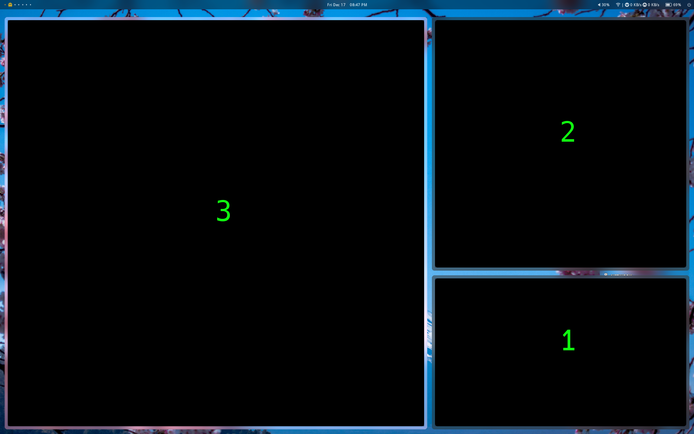
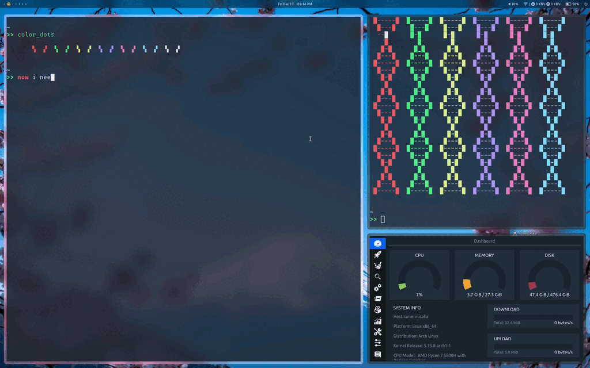

# x-window-selector

`x-window-selector` will display custom label on your window surface. It aims to quick select a window and get the window id without mouse/touchpad. This project is forked from [xorg-choose-window](https://github.com/ikn/xorg-choose-window), and add some feature. You can use custom font style and set the font size.





## Install

Clone this project and ensue you have installed following dependency.

- `libxcb`
- `xcb-util-keysyms`
- `xcb-util-wm`

Then

```Bash
$ cd x-window-selector
$ make clean  # build the binary file
$ make install  # install the /usr/bin
```

## Usage

```
Usage: x-window-selector [OPTION...] CHARACTERS

Running the program draws a string of characters over each visible window.
Typing one of those strings causes the program to print the corresponding
window ID to standard output and exit.  If any non-matching keys are pressed,
the program exits without printing anything.

CHARACTERS defines the characters available for use in the displayed strings;
eg. 'asdfjkl' is a good choice for a QWERTY keyboard layout.  Allowed
characters are the numbers 0-9 and the letters a-z.

The program exits with status 0 on success, 64 on invalid arguments, and 70 if
an unexpected error occurs.

  -b, --blacklist=WINDOWID   IDs of windows to ignore (specify this option
                             multiple times)
  -f, --format=FORMAT        Output format: 'decimal' or 'hexadecimal'
  -s, --font-size=FONT-SIZE  size of text font that will be displayed in your
                             window
  -t, --font-path=FONT-PATH  which font you want to use, please give the
                             font(ttf) absolute path
  -w, --whitelist=WINDOWID   IDs of windows to include (include all if none
                             specified) (specify this option multiple times)
  -?, --help                 Give this help list
      --usage                Give a short usage message
  -V, --version              Print program version

Mandatory or optional arguments to long options are also mandatory or optional
for any corresponding short options.
```

## Have fun

You can use it with other application, such as `bspwm`, a tilling window manager. I will show how to swap windows in `bspwm` with `x-window-selector`.


Replace the variable in `<>` and save this script file.

```
FontSize=<font size> 
FontPath=<your font ttf file path> 
FocusWin=$(bspc query -N -n focused)
NewWin=$(x-window-selector -b ${FocusWin} -s ${FontSize} --font-path ${FontPath} 123456)
bspc node -s ${NewWin}
bspc node -f ${NewWin}
```

Add following code in your `sxhkdrc`

```
super + s;
    sh <your script path>
```

Reload sxhkd daemon by `pkill -USR1 -x sxhkd`. Press `Super + s`, then you can quick swap two window.




## License

Apache-2.0 License.
